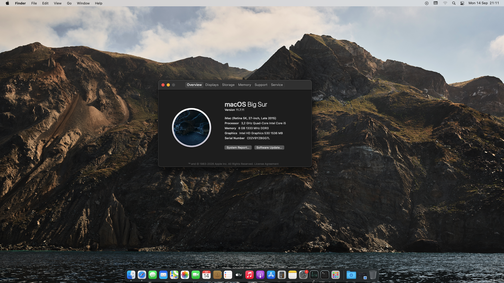

# OptiPlex 3040 SFF — Hackintosh (OpenCore)

EFI e documentação para rodar macOS em um Dell OptiPlex 3040 SFF, usando o bootloader OpenCore gerado com o **OpenCore Simplify**.

## 💻 Especificações do hardware

| Componente       | Modelo                               |
|------------------|---------------------------------------|
| CPU              | Intel Core i5-6500 (Skylake)          |
| GPU              | Intel HD Graphics 530 (integrada)     |
| RAM              | 8 GB DDR3L                            |
| Armazenamento    | HD interno 500 GB                     |
| Rede             | Ethernet (cabo) — sem Wi-Fi/Bluetooth |
| Formato          | Small Form Factor (SFF)               |

## ✅ Compatibilidade de macOS

| Versão         | Status      |
|-----------------|------------|
| Big Sur (11)    | ✅ Testado / funcional |
| Monterey (12)   | ✅ Testado / funcional — até **12.7.6** (última versão da série, lançada em jul/2024 — Monterey está oficialmente sem suporte da Apple desde set/2024) |

> Recomenda-se instalar a versão mais recente disponível dentro dessa faixa (Big Sur ou Monterey 12.7.6), já que são as últimas com patches de segurança para essa série.

## ⚠️ Antes de instalar — leia isso

- **Gere o seu próprio SMBIOS.** O EFI anexado a este repositório **não** deve ser usado com o SMBIOS original. Use o [GenSMBIOS](https://github.com/corpnewt/GenSMBIOS) para gerar um serial, MLB e UUID únicos e substitua os valores em `config.plist` (seção `PlatformInfo`). Usar o mesmo SMBIOS de outra pessoa pode gerar bloqueios em serviços Apple (iMessage, iCloud, etc).
- Use um **pendrive de no mínimo 8 GB** para criar o instalador USB.
- Rede (Wi-Fi/Bluetooth) não é abordada aqui — este build assume **Ethernet via cabo**.
- **Durante toda a instalação, não utilize periféricos Bluetooth (mouse, teclado, etc).** Como este build não trata Bluetooth, use apenas periféricos **com fio (USB)** do início ao fim do processo — desde o boot do instalador até a configuração inicial do macOS — para evitar travamentos por falta de reconhecimento do dispositivo.

## 🖥️ Resultado



## 🗂️ Estrutura do repositório

```
OptiPlex3040-Hackintosh/
├── EFI/
│   └── OC/
│       ├── config.plist
│       ├── ACPI/
│       ├── Kexts/
│       ├── Drivers/
│       ├── Tools/
│       └── Resources/
├── Docs/
│   ├── hardware-report.txt
│   ├── guia-instalacao.md
│   └── changelog.md
├── Screenshots/
│   ├── about-this-mac.png
│   └── geekbench.png
├── LICENSE
└── .gitignore
```

## 🚀 Instalação (resumo)

1. Baixe o instalador do macOS (Big Sur ou Monterey 12.7.6) pela App Store ou via [gibMacOS](https://github.com/corpnewt/gibMacOS).
2. Crie o pendrive bootável (mínimo 8 GB).
3. Copie a pasta `EFI/` deste repositório para o pendrive.
4. **Gere seu próprio SMBIOS** (veja aviso acima) antes de dar boot.
5. Ajuste `config.plist` conforme seu hardware, se necessário (o OpenCore Simplify já deixa a base pronta para Skylake + HD 530).
6. Instale normalmente pelo Recovery do macOS.
7. Após instalado, copie a EFI (já com o SMBIOS próprio) para a partição EFI do disco interno.

Instruções detalhadas passo a passo estão em [`Docs/guia-instalacao.md`](Docs/guia-instalacao.md).

## 📖 Referências

- [Dortania's OpenCore Install Guide](https://dortania.github.io/OpenCore-Install-Guide/) — guia oficial de referência para configuração do OpenCore.
- [OpenCore Simplify](https://github.com/lzhoang2801/OC-Simplify) — ferramenta usada para gerar esta EFI base.
- [GenSMBIOS](https://github.com/corpnewt/GenSMBIOS) — geração de SMBIOS único.

## 🙏 Créditos

- Acidanthera (OpenCore, Lilu, WhateverGreen, VirtualSMC e demais kexts)
- Comunidade Dortania
- Desenvolvedores dos kexts de terceiros utilizados (ver `EFI/OC/Kexts/`)

## 📄 Licença

Este projeto está sob a licença MIT — veja o arquivo [LICENSE](LICENSE) para detalhes. As specs e configurações aqui compartilhadas são fruto de testes próprios; use por sua conta e risco.
